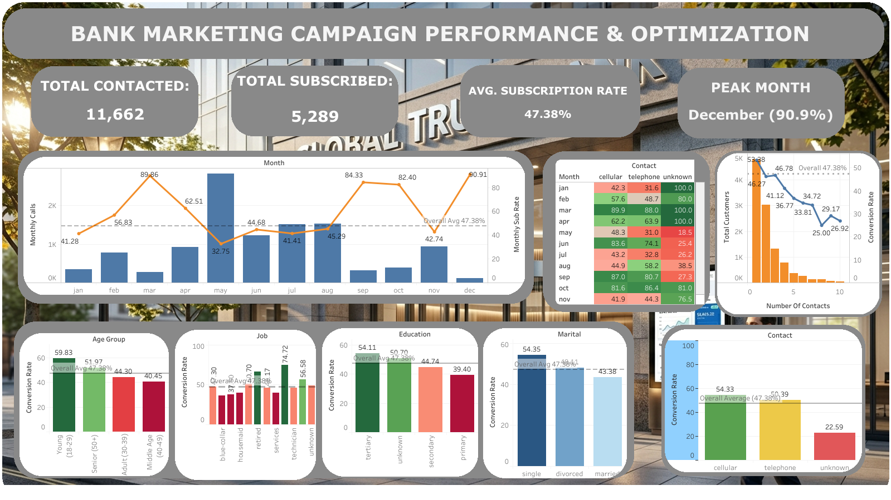

# 🏦 Bank Marketing Campaign Performance & Optimization

## 📌 Project Overview
Analysis of a Portuguese bank's telephone marketing campaign 
to uncover what drives term deposit subscriptions and optimize 
future campaign strategy.

## 🛠️ Tools Used
- **PostgreSQL** — Data querying and analysis
- **Tableau Public** — Interactive dashboard and visualization
- **GitHub** — Version control and project documentation

## 📊 Dataset
- **Source:** UCI Machine Learning Repository via Kaggle
- **Records:** 11,662 customer contacts
- **Target Variable:** Term deposit subscription (yes/no)
- **Overall Subscription Rate:** 47.38%

---

## 📈 Dashboard Preview

> 🔗 [View Live Tableau Dashboard](https://public.tableau.com/views/BankDataAnalysis_17762651796660/Dashboard1?:language=en-US&:sid=&:redirect=auth&:display_count=n&:origin=viz_share_link)

---

## 🎯 Key Metrics
| Metric | Value |
|---|---|
| Total Customers Contacted | 11,662 |
| Total Subscribed | 5,289 |
| Average Subscription Rate | 47.38% |
| Peak Month | December (90.9%) |

---

## 📋 Problem Statements

### PS1 — Campaign Overview & Monthly Performance
**Business Question:** What was the overall subscription rate 
and how did performance vary by month?

**Key Findings:**
- December was the peak month at 90.9% conversion 
  despite only 110 calls
- May had the highest call volume (2,824) but the lowest 
  conversion at 32.75%
- High call volume months consistently underperformed 
  low volume months — inverse relationship confirmed
- Months above average: Mar, Feb, Apr, Sep, Oct, Dec

**Recommendation:** Shift campaign budget toward Q4 and 
selective Q1 targeting where conversion rates are highest.

---

### PS2 — Customer Profile Analysis
**Business Question:** Who is most likely to subscribe to 
a term deposit?

**Key Findings:**
- **Age:** Young (18-29) converted highest at 59.83%, 
  Middle Age (40-49) lowest at 40.45%
- **Job:** Students (74.72%) and Retired (66.32%) are 
  the top converting segments
- **Education:** Tertiary educated customers converted 
  at 54.11% vs Primary at 39.40%
- **Marital:** Single customers outperformed married 
  by 10.97 percentage points (54.35% vs 43.38%)

**Ideal Customer Profile:**
> Young, single student with tertiary education
> Secondary profile: Senior retired customer with tertiary education

**Recommendation:** Prioritize students and retired customers 
as primary target segments in future campaigns.

---

### PS3 — Contact Strategy Analysis
**Business Question:** How does the number of contacts 
affect conversion rates?

**Key Findings:**
- Customers contacted fewer times converted at higher rates
- Conversion drops significantly after the first few contacts
- Over-calling leads to customer fatigue and lower conversion

**Recommendation:** Limit contacts per customer and focus 
on quality of outreach over quantity.

---

### PS4 — Contact Channel Analysis
**Business Question:** Which contact method drives 
the best results?

**Key Findings:**
- Cellular: **54.33%** conversion — best performing channel
- Telephone: **50.39%** conversion — above average
- Unknown: **22.59%** conversion — significantly underperforming
- Unknown contacts suppress true campaign performance 
  by 6.6 percentage points
- True intentional outreach rate: **53.98%** 
  (excluding unknown contacts)

**Recommendation:** 
1. Prioritize cellular outreach in all future campaigns
2. Enforce mandatory CRM channel logging — no contact 
   should be saved without a verified channel
3. Exclude unknown contacts from active campaign lists 
   until channel is verified

---

### PS5 — Month & Contact Channel Heatmap
**Business Question:** Which month and contact type 
combinations are the highest performing sweet spots?

**Key Findings:**
- December Cellular: **95.6%** — highest combination
- September Cellular: **87.0%**
- March Cellular: **89.9%**
- May Unknown: **18.5%** — worst performing combination
- Unknown contact type consistently underperforms 
  across all months

**Recommendation:** Run cellular campaigns specifically 
in December, March, September and October for maximum ROI.

---

## 💡 Overall Recommendations Summary

| # | Finding | Recommendation | Expected Impact |
|---|---|---|---|
| 1 | Volume ≠ Performance | Shift budget to Mar, Sep, Oct, Dec | Higher conversion per call |
| 2 | Cellular outperforms all | Prioritize cellular outreach | +4 points over telephone |
| 3 | Unknown contacts drag metrics | Mandatory CRM channel logging | +6.6 points overall rate |
| 4 | Students & Retired convert best | Target these as primary segments | 66-74% conversion potential |
| 5 | Education directly correlates | Focus on tertiary educated customers | +14 points vs primary |
| 6 | Single customers outperform married | Adjust targeting filters | +10 points vs married |
| 7 | Blue collar underperforms | Reduce blue collar contact volume | Free budget for better segments |

---

## 📁 Project Structure
```
bank-marketing-analysis/
│
├── README.md
├── data/
│   ├── raw/
│   │   └── bank.csv
│   └── exports/
│       ├── ps1_campaign_overview.csv
│       ├── ps2_contact_type.csv
│       ├── ps2_month_contact.csv
│       ├── ps2_age_group.csv
│       ├── ps2_job.csv
│       ├── ps2_education.csv
│       └── ps2_marital.csv
│
├── sql/
│   ├── ps1_campaign_overview.sql
│   ├── ps2_contact_type.sql
│   ├── ps2_month_contact.sql
│   ├── ps2_customer_profile.sql
│   ├── ps3_contact_strategy.sql
│   └── ps4_channel_analysis.sql
│
├── tableau/
│   ├── bank_marketing_dashboard.twbx
│   └── dashboard_preview.png
│
└── insights/
    └── findings_and_recommendations.md
```

---

## 👤 Author
**John Butch Gromontil**
- 🔗 [LinkedIn](your-linkedin-link)
- 📊 [Tableau Public](your-tableau-public-link)
- 🐙 [GitHub](your-github-link)
